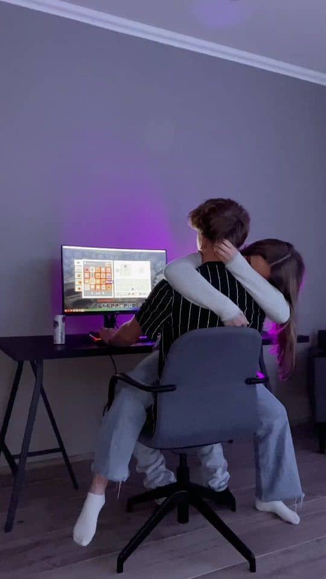

<html lang="en">
<head>
<meta charset="UTF-8">
<title>From getitin</title>
<meta name="viewport" content="width=device-width, initial-scale=1.0">

</head>

<body>

<!-- PASSWORD SCREEN -->

  <h1>Who Named Your Boobs >3</h1>
  <input id="answer" placeholder="type here…">
  <button onclick="unlock()">Submit</button>

<!-- HOME SCREEN -->

  

    <h2>Welcome baby girl 💗</h2>
    
Enjoy your stay

    

      
💌 Love Letter??

      
🎶 Music

      
📝 Notes

      
🖼 Gallery

    

    <!-- Love Letter?? -->
    

      since you didnt want any valentines gift this is what i thought of.
      You know you could always send me selfies of michael and Felix any day
      that you want. XoXo
    

    <!-- MUSIC -->
    

      <strong>No Guidance — Drake ft Chris Brown</strong>
      <audio controls>
        <source src="jayy/no-guidance.mp3" type="audio/mpeg">
      </audio>

        

      <strong>WGFT — Gunna</strong>
      <audio controls>
        <source src="jayy/wgft.mp3" type="audio/mpeg">
      </audio>
    

    <!-- Notes -->
    

      you know we can always touch, kiss, cuddle and do the other stuff
      right as friends of course... >3
    

    <!-- Gallery -->
    

      <strong>our To-Do list ❤️</strong>
      

        
        
        
        
        
        
        
      

    

  

</body>
</html>

